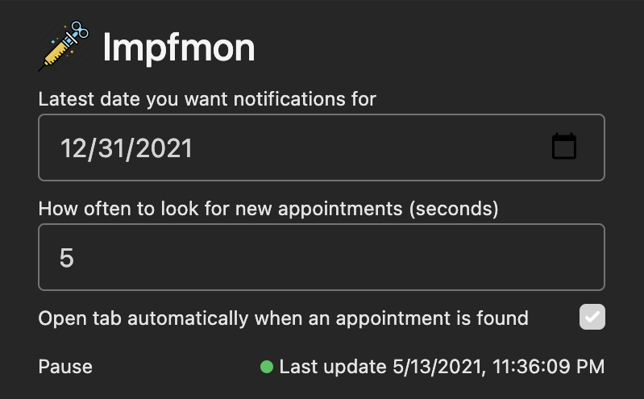

# Impfmon

## About

Impfmon is a chrome extension that polls impfstoff.link for new appointments and sends you a notification + opens a tab if desired when one is found.
It also allows you to specify a max date for an appointment if you have time constraints or simply want to find a better date.

## How to install

As I was informed, Chrome no longer allows you to simply install a `.crx` file by drag and drop and packed extensions all have to go through the web store.

I haven't found any workarounds and don't really want to deal with the process of adding the extension to the web store.

Thus, the probably simplest way is actually to download and build the extension yourself and load it into chrome unpacked.

1. Clone repo `git clone git@github.com:TimBeyer/impfmon.git`
2. Open directory `cd impfmon`
3. Ensure `node` is installed
4. Install dependencies `npm install`
5. Build extension `npm run build`
6. Go to Chrome -> More tools -> Extensions
7. Enable "Developer Mode" switch
8. Click "Load unpacked"
9. Navigate to the `dist` directory of the `impfmon` repo and select it

Now you should have the extension running, and even be ready to contribute.

## How to configure

You can click on the extension icon and then 'Options' to configure if a tab should be opened automatically, how often to poll, and what your max desired date is.

## Attributions

Icons made by [Flat Icons](https://www.flaticon.com/authors/flat-icons) from [https://www.flaticon.com/](www.flaticon.com)
